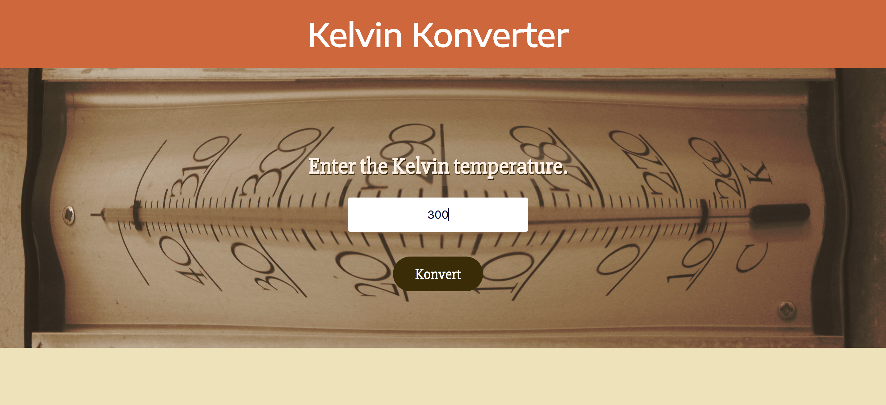

## Kelvin Weather Converter  ReadMe

#### Intro
Title: Kelvin Temperature Converter

This converter takes a Kelvin temperature and converts it to Celsius and Fahrenheit then display the results to the DOM with a sentence and picture.

#### Setup
1. Develop webpage
 * make static HTML page for basic design
    * Use HTML input to get Kelvin temperature

    * Render equation results in a sentence along with image matching the temperature result.
2. break up into React components --> [More Details](./src/components/)
3. Add additional logic and control flow with methods and React props and state

#### Usage
Use this converter to take a Kelvin temperature and convert it to Celsius and Fahrenheit then display the results on a webpage.

