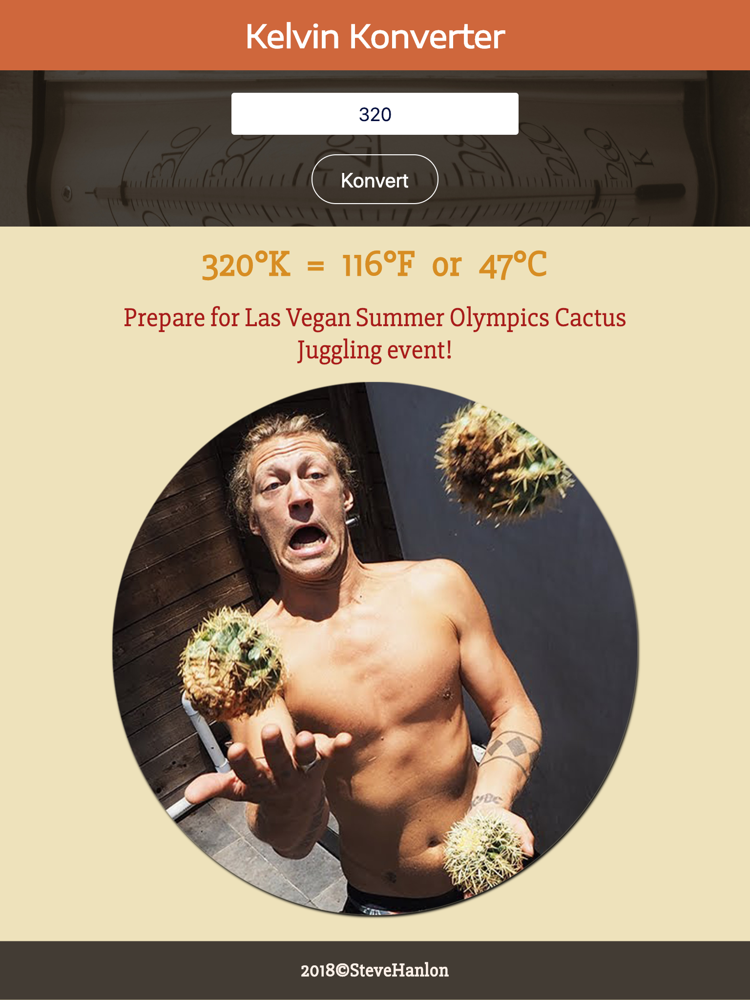
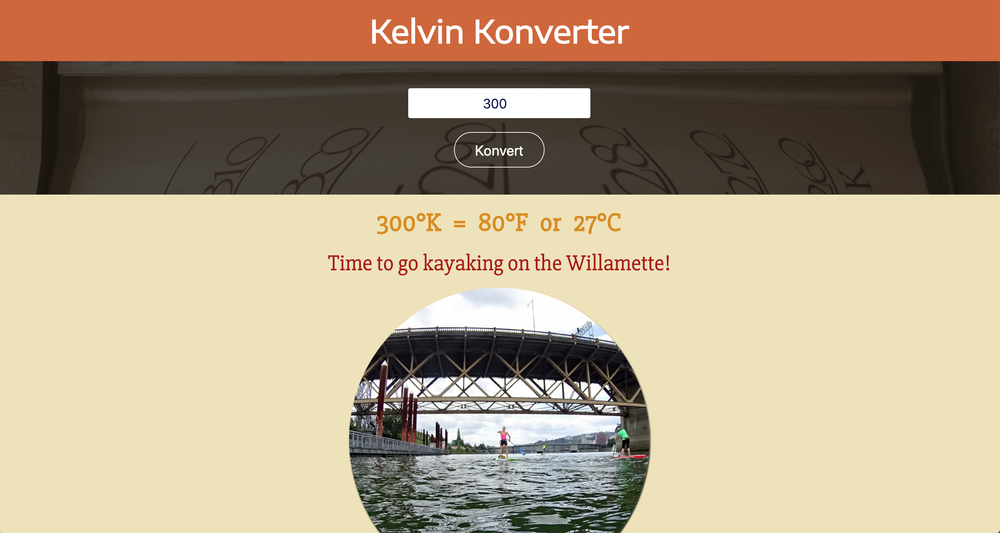

## Kelvin Weather Converter  
##### Project idea from the [Build Front-End Web Applications from Scratch](https://www.codecademy.com/programs/f151998eb027eb35e15b2081ee6ef9a0/items/5a22ebe10f46132133c31dd07b44df82) course at Code Academy 2016

#### Introduction

**Title**: Kelvin Konverter

This converter takes a Kelvin temperature and converts it to Celsius and Fahrenheit then display the results in F and C along with a corresponding sentence and outdoor activity appropriate for that temperature (i.e. camel races in the Sahara Desert for temps above 130 degrees F; invest in flavored snow cone business and ice sculpture museum for negative temperatures, etc.).

***The goal*** of the project was to take an easy task and refactor it with React to develop React component building skills.

##### Start-up Server

To run the server, NPM or Yarn must be installed.

Open up the terminal and go to the project directory.  Inside of the project directory, run:

`npm install`

`npm start`

If you have Yarn installed run:

`yarn start`

This project was built using *Create React App*.  For complete technical details click [Create React App](./docs/README.md)

##### Technical Components
- Flexbox  
- Media queries used to build the *responsive design*.
- JavaScript (ECMASript 6)
- React 16.5.2
- Accessibility-ready

##### Articles and Tutorials
[Based on this javascript lesson at Code Academy but expanded to React for practice.](https://www.codecademy.com/learn/introduction-to-javascript)

#### Picture of React Component Map

#### Pictures of Responsive Design
##### Phone

##### Tablet

##### Desktop

#### Planning and Workflow
1. Develop webpage UI
 * make static HTML page for basic design
    * Use HTML input to get Kelvin temperature

    * Render equation results in a sentence along with image matching the temperature result.
2. break UI into React components --> [See component map above](#picture-of-react-component-map)
3. Add additional logic with methods and control flow with  components passing props and state
